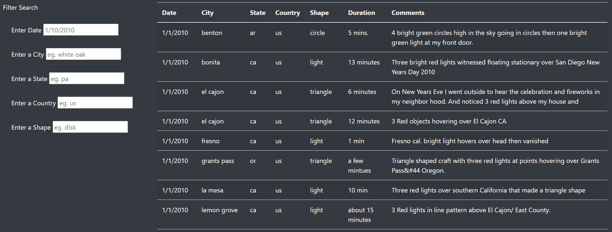
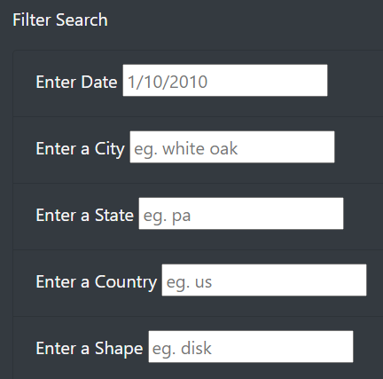

# UFO Sightings 

## Overview 
UFO Sightings project provides a more in-depth analysis of UFO sightings by allowing users to filter for multiple criteria at the same time. A dynamic webpage is to be created by inserting Javascript into HTML. The webpage will allow users to use filters for date, city, state, country, and shape of the lights seen. 

### Purpose 
The purpose of this analysis is to create filters using JavaScript and HTML which will update the search criteria after pressing "Enter". The following functions are to be created:

- Create a function that saves the element, value, and id of the filter that was changed. 
- Create a new function to loop through the dataset and keep only the results that match the search criteria. 

## Analysis 

Data Source: [UFO Sightings Data Set](static/js/data.js)

Software used: Javascript, HTML, CSS

Analysis: https://bholeneha.github.io/UFOs/

## Results
Click here to visit the website -> [UFOs](https://bholeneha.github.io/UFOs/). 

This webpage loads with the entire data set in a table (as shown below). 

The user can filter for the criteria date, city, state, country and shape using the provided textbox.

 

Examples of formats for the search criteria are shown in the textbox (as shown in the image below). For example, state search box takes in the state codes, countries takes in country codes and format for the date is dd/mm/yyyy. All search criteria may be entered in lower case. 

Once the input has been typed in the textbox, pressing "Enter" will update the table with filtered data.

## Summary

This design has many drawbacks and could benefit from further development. 

### Drawbacks of this design:

- Limited filter capability. For example, cannot filter by multiple values for the same criteria.  
- Removing all filters is difficult.

### Ideas for futher development:
There is a number of ways this code can be further developed:
- Select multiple values for the same criteria at the same time. 
- Filter by range of dates instead of single date. 
- Adding a clear/reset all filters via button.
- Having active filter tags clearly visible and being able to remove them individually. 

